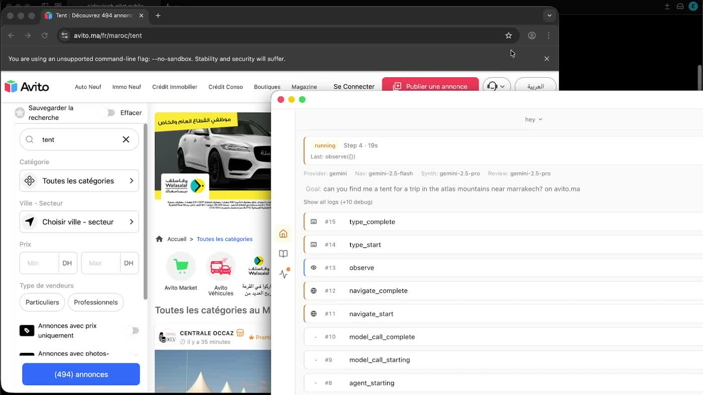

# WebPilot

Open-source agentic browser with Playwright control, bring-your-own model providers, local Ollama support, and an Electron desktop shell.

WebPilot is meant to be a hackable, local-first alternative to closed agentic browsers. The default browser is Playwright Chromium, but the desktop app can also target installed browser channels and user-selected profile folders where the platform allows it.

## Demo

[](https://ahamsel.com/assets/videos/webpilot_vid.mp4)

[Watch the 85-second demo in your browser](https://ahamsel.com/assets/videos/webpilot_vid.mp4)

## Features

- Desktop app built with Electron and Next.js.
- Browser extension for Chrome, Edge, Brave and Arc: WebPilot in the side panel, working in your current tab with your existing logins ([extension/README.md](./extension/README.md)).
- Browser automation through Playwright MCP, running on the latest stable Playwright.
- Fast mode: TypeSafe's Jev decision model (through OpenRouter) picks each browser action in ~0.3s while the LLM only writes text, with automatic fallback to the LLM planner.
- Model providers: OpenRouter (one key for Gemini, Claude, GPT, Qwen, DeepSeek and hundreds more) and local Ollama.
- Runtime settings UI for provider, model, browser source, profile strategy, headless mode, and isolation.
- Local run recording with logs, step traces, artifacts, timing, and final results.
- Thread history for follow-up tasks, with controls to delete individual runs, delete conversations, or clear saved history.
- MCP endpoint and stdio server for external agents and tools.
- Unsigned desktop packaging for macOS, Windows, and Linux release candidates.
- Versioned browser tool schemas with adapter tests for provider/MCP shape changes.

## Quick Start

```bash
npm install
npm run dev
```

Open `http://localhost:3000`.

For the desktop shell:

```bash
npm run desktop:dev
```

For normal app usage, configure model providers, API keys, base URLs, and browser/profile behavior from the in-app Settings screen. A `.env.local` file is optional and mainly useful for development, server-side defaults, CLI runs, or automation scripts.

## macOS Install Note

WebPilot alpha builds are currently unsigned and not notarized. macOS may show "Apple could not verify WebPilot is free of malware."

To open the app:

1. Open WebPilot once and click Done if macOS blocks it.
2. Go to System Settings > Privacy & Security.
3. Scroll down and click Open Anyway for WebPilot.
4. Confirm, then open WebPilot again.

Only do this after downloading WebPilot from the official GitHub release and verifying the SHA-256 checksum shown in the release notes.

## Model Setup In The App

Open Settings, choose OpenRouter or Ollama, enter your OpenRouter key or local endpoint, choose models, and settings save automatically.

OpenRouter gives one API key and one API for most hosted models. The settings screen lists every OpenRouter model that supports tool calling, with context size and pricing, and accepts any model id in `vendor/model` form (for example `google/gemini-3.8-flash` or `anthropic/claude-sonnet-5`).

Settings saved for the older Gemini, OpenAI, and Claude providers are reset to OpenRouter defaults, because those keys and model ids do not work on OpenRouter. Enter an OpenRouter key after upgrading.

Optional development defaults can be set with environment variables:

OpenRouter:

```bash
OPENROUTER_API_KEY=sk-or-...
MODEL_NAV_MODEL=google/gemini-3.8-flash
MODEL_SYNTH_MODEL=anthropic/claude-sonnet-5
```

Ollama:

```bash
MODEL_PROVIDER=ollama
MODEL_BASE_URL=http://127.0.0.1:11434/v1
```

The settings UI can discover local Ollama models and hides known embedding-only models when Ollama reports enough metadata to identify them.

## Browser Extension

```bash
npm run extension:build
```

Load `extension/dist` from `chrome://extensions` (Developer mode > Load unpacked), then click the WebPilot icon to open the side panel and **Connect OpenRouter**. See [extension/README.md](./extension/README.md) for how it works, permissions and privacy.

## Fast Mode

Turn on **Fast mode (Jev)** in Settings (OpenRouter only). Instead of asking the LLM to plan every click, WebPilot asks [Jev](https://openrouter.ai/typesafe/jev-1.13), a decision model that returns a choice with probabilities in about 0.3 seconds. The LLM still writes anything that needs text (search queries, the final answer), and the regular planner takes over whenever Jev is stuck, blocked, or about to click something irreversible.

Measure it on your own tasks:

```bash
OPENROUTER_API_KEY=sk-or-... npm run bench:fast-mode
```

In fast mode the page text and element labels of each step are sent to TypeSafe through OpenRouter.

## Browser Modes

The app supports these runtime browser modes:

- Managed Playwright browser with temporary, app profile, custom folder, or memory-only profile behavior.
- Installed browser channels such as Chrome, Edge, and Firefox where Playwright supports the target.
- Existing browser connection through Chrome DevTools Protocol.
- Custom executable path for advanced users.

Profile discovery is platform-specific and conservative. Browser profile data can contain cookies and private browsing state, so treat profile paths as sensitive.

## History Storage

WebPilot stores run history and thread history locally. The Library and Activity views can delete individual runs, delete a thread and its runs, or clear saved history. These actions remove saved run/thread records and run artifacts only; they do not delete model settings, browser profile folders, or future opt-in cache data.

## Useful Commands

```bash
npm run build
npm run test
npm run browsers:install
npm run browser:smoke
npm run health
npm run agent:cli -- "Go to https://example.com and summarize the page"
npm run bench:fast-mode
npm run mcp:stdio
npm run desktop:build
```

`npm run browser:smoke` uses a local fixture page and Playwright Chromium. It does not require model credentials or external websites.

## Desktop Builds

`npm run desktop:build` creates an unsigned/ad-hoc desktop build for the current platform. Use `npm run desktop:build:signed` only when you have signing credentials configured.

Platform-specific commands:

```bash
npm run desktop:build:mac
npm run desktop:build:win
npm run desktop:build:linux
npm run desktop:smoke
```

Windows builds produce unsigned NSIS `.exe` and `.zip` artifacts under `desktop_dist/`. The default unsigned Windows command skips executable signing/resource editing so it can run from a normal PowerShell session; Windows SmartScreen may warn because these builds are not trusted code-signed releases.

Linux builds produce AppImage and `.zip` artifacts under `desktop_dist/`. Linux packaging is prepared for native Linux runners and the `Package Desktop` GitHub Actions workflow.

## Tool Schema Strategy

Browser-agent tools are declared in `lib/tool-schema.ts` with schema version `webpilot.browser-tools.v1`. Model providers receive normalized tool declarations, so WebPilot is not coupled to one raw MCP or provider payload shape. Unit tests cover current, legacy, and future-style schema variants.

## Project Docs

- [ARCHITECTURE.md](./ARCHITECTURE.md)
- [RUNNING.md](./RUNNING.md)
- [DESKTOP.md](./DESKTOP.md)
- [TESTING.md](./TESTING.md)
- [THREADS.md](./THREADS.md)
- [docs/RELEASE.md](./docs/RELEASE.md)

## License

GPL-3.0-or-later. Contributions must be compatible with that license.
